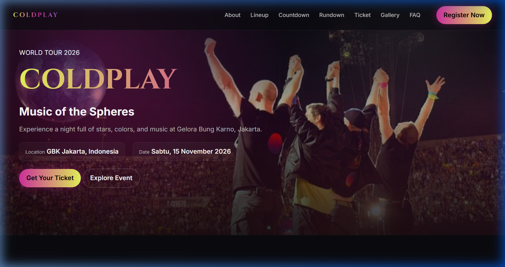
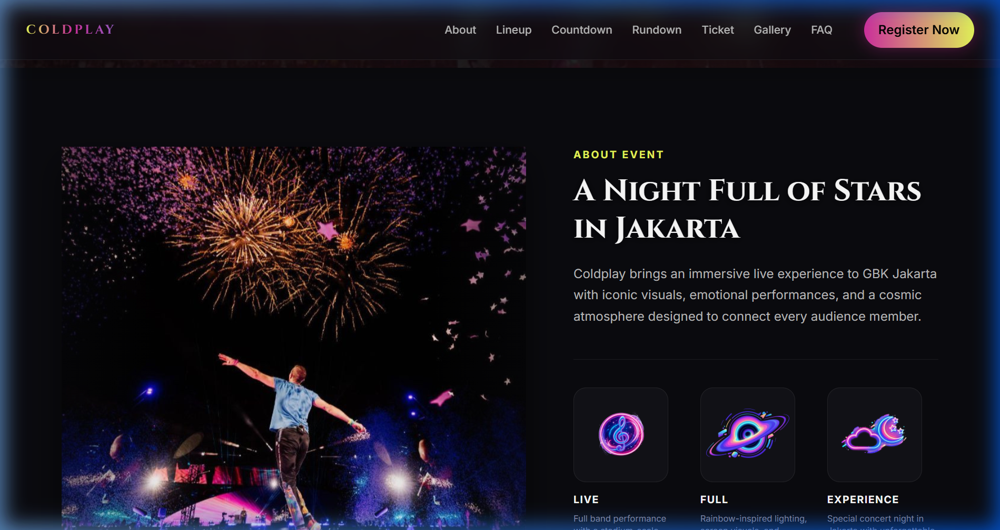
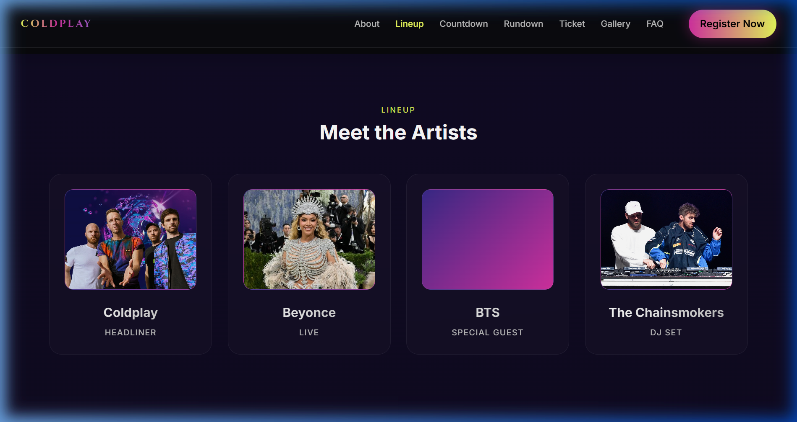
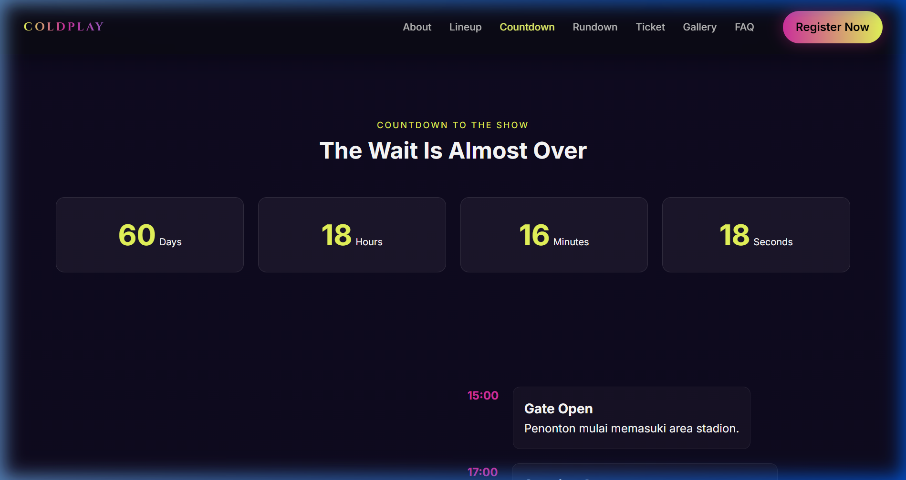
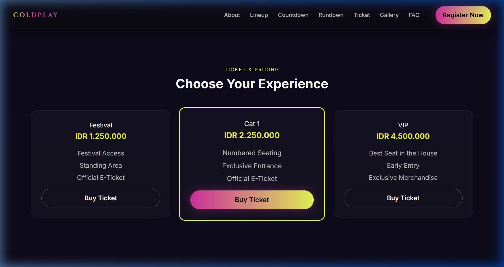
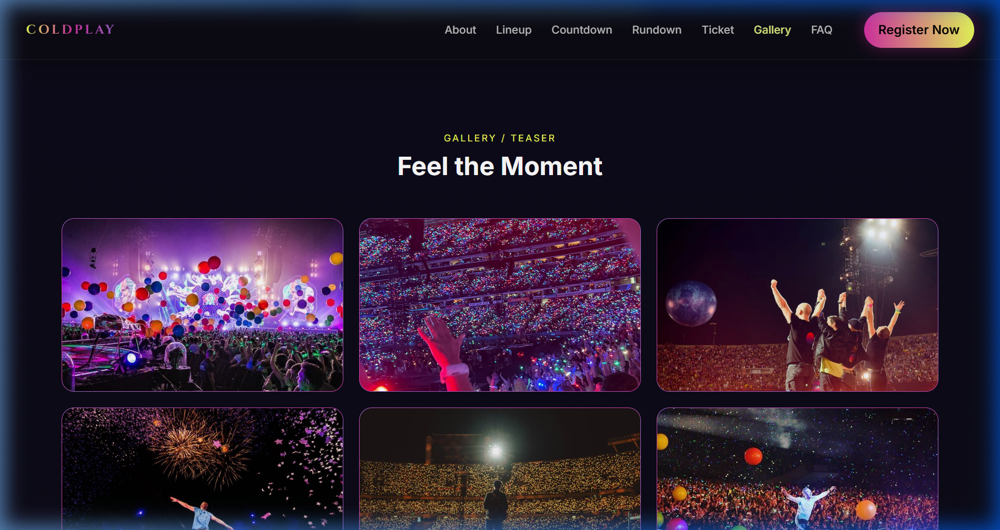

# 🎵 Coldplay — Music of the Spheres World Tour 2026

<div align="center">

**Interactive Concert Event Landing Page · GBK Jakarta, Indonesia**

[](https://ibnusyafrizal15-cmyk.github.io/PROJECT-EVENT-COLDPLAY/)
[](https://developer.mozilla.org/en-US/docs/Web/HTML)
[](https://developer.mozilla.org/en-US/docs/Web/CSS)
[](https://developer.mozilla.org/en-US/docs/Web/JavaScript)
[](LICENSE)
[](https://ibnusyafrizal15-cmyk.github.io/PROJECT-EVENT-COLDPLAY/)

</div>

---

## 📸 Preview

### Hero Section


### About the Event


### Artist Lineup


### Countdown Timer


### Ticket Pricing


### Photo Gallery


---

## 📋 About This Project

**Coldplay — Music of the Spheres World Tour 2026** is a fully interactive concert event landing page built for the Coldplay concert at **Gelora Bung Karno (GBK), Jakarta** on **Saturday, 15 November 2026**.

The page was engineered using **pure HTML5, CSS3, and Vanilla JavaScript** — zero external frameworks or libraries — ensuring blazing-fast load times, full responsiveness across all devices, and robust SEO performance.

> **Event:** Coldplay — *Music of the Spheres* World Tour  
> **Venue:** Gelora Bung Karno (GBK), Jakarta, Indonesia  
> **Date:** Saturday, 15 November 2026  
> **Artists:** Coldplay · Beyoncé · BTS · The Chainsmokers  

---

## ✨ Features

| Feature | Description |
|---|---|
| 🎯 **Hero Section** | Full-screen hero with dynamic orbital CSS animations and cosmic atmosphere |
| 👥 **Artist Lineup** | Artist card grid — Coldplay (Headliner), Beyoncé (Live), BTS (Special Guest), The Chainsmokers (DJ Set) |
| ⏱️ **Live Countdown Timer** | Real-time JavaScript countdown counting down to the concert date |
| 📅 **Show Rundown Timeline** | Visual event schedule from Gate Open (15:00) to Closing (22:45) |
| 🎟️ **Ticket Pricing Cards** | 3-tier ticket system: Festival · Cat 1 · VIP with full pricing details |
| 🖼️ **Photo Gallery + Lightbox** | Masonry photo gallery with an interactive lightbox viewer and captions |
| ❓ **FAQ Accordion** | Smooth animated FAQ accordion with keyboard accessibility |
| 📝 **Registration Form** | Ticket registration form with client-side validation |
| 📱 **Responsive Hamburger Navbar** | Smooth mobile navigation with overlay drawer |
| 🌟 **Glassmorphism UI** | Modern glassmorphism design with glow effects and animated rings |

---

## 🛠️ Tech Stack

```
├── HTML5       → Semantic markup, accessibility (aria attributes), SEO meta tags
├── CSS3        → Custom properties, CSS Grid, Flexbox, keyframe animations
├── JavaScript  → Vanilla ES6+ (Countdown Timer, FAQ Accordion, Lightbox, Navbar)
└── Google Fonts → Cinzel (display/titles) + Inter (body text/UI)
```

**No frameworks. No dependencies. Zero build tools required.**

---

## 📁 Project Structure

```
PROJECT-EVENT-COLDPLAY/
│
├── index.html                 # Main entry point — full page structure
├── style.css                  # Global styles, design tokens, animations
├── script.js                  # Client-side interactivity (countdown, lightbox, FAQ, navbar)
├── README.md                  # Project documentation
│
└── assets/
    ├── img/
    │   ├── coldplay.jpg           # Headliner artist photo
    │   ├── beyonce.jpeg           # Artist photo
    │   ├── bts.jpg                # Artist photo
    │   ├── chainsmokers.jpeg      # Artist photo
    │   ├── aboutt.jpg             # About section image
    │   ├── footage.jpg            # Gallery image 1
    │   ├── footage 2.jpg          # Gallery image 2
    │   ├── footage 3.jpg          # Gallery image 3
    │   ├── footage 4.jpg          # Gallery image 4
    │   ├── bg.jpg                 # Background image
    │   ├── bg2.jpg                # Background image (alt)
    │   ├── sound.png              # Feature icon — Live Performance
    │   ├── galaxy.png             # Feature icon — Cosmic Visuals
    │   └── night.png              # Feature icon — Experience
    │
    └── screenshots/
        ├── hero.png               # Hero section screenshot
        ├── about.png              # About section screenshot
        ├── lineup.png             # Artist lineup screenshot
        ├── countdown.png          # Countdown timer screenshot
        ├── ticket.png             # Ticket pricing screenshot
        └── gallery.png            # Photo gallery screenshot
```

---

## 🚀 Getting Started

### Prerequisites
No prerequisites required — this is a pure static HTML/CSS/JS project.

### 1. Clone the Repository
```bash
git clone https://github.com/ibnusyafrizal15-cmyk/PROJECT-EVENT-COLDPLAY.git
cd PROJECT-EVENT-COLDPLAY
```

### 2. Open in Browser
Simply open `index.html` directly in your browser:

```bash
# Windows
start index.html

# macOS
open index.html

# Linux
xdg-open index.html
```

### 3. Use Live Server (Recommended for Development)
Install the **Live Server** extension in VS Code, then right-click `index.html` → **Open with Live Server**.

---

## 🌐 Live Demo

> 🔗 **[https://ibnusyafrizal15-cmyk.github.io/PROJECT-EVENT-COLDPLAY/](https://ibnusyafrizal15-cmyk.github.io/PROJECT-EVENT-COLDPLAY/)**

Hosted for **free** using **GitHub Pages** — automatically deployed from the `main` branch.

---

## 📱 Responsive Design

Fully optimized across all screen sizes:

| Breakpoint | Target Devices |
|---|---|
| `320px+` | Small Mobile |
| `480px+` | Mobile |
| `768px+` | Tablet |
| `1024px+` | Desktop |
| `1440px+` | Large Desktop |

---

## 🎨 Design System

### Color Palette
| Token | Value | Usage |
|---|---|---|
| Primary Purple | `#8B5CF6` | Accents, buttons |
| Secondary Pink | `#EC4899` | Gradients, highlights |
| Dark Background | `#0B0D11` | Page background |
| Text Primary | `#F8FAFC` | Headlines, body |
| Glow Effects | CSS `blur()` | Rings, overlays |

### Typography
| Font | Usage |
|---|---|
| **Cinzel** (serif display) | Event titles, brand name |
| **Inter** (sans-serif) | Body text, navigation, UI |

---

## 🔧 Page Sections

| # | Section | Description |
|---|---|---|
| 1 | **Navbar** | Sticky navigation bar with animated brand orbits and hamburger menu |
| 2 | **Hero** | Full-screen hero with WORLD TOUR 2026 headline, date/venue info, and CTA buttons |
| 3 | **About** | Event overview with feature highlights (Live, Full Production, Experience) |
| 4 | **Lineup** | Artist grid — 4 performers with photos, roles, and categories |
| 5 | **Countdown** | Live Days / Hours / Minutes / Seconds countdown to show day |
| 6 | **Rundown** | Timeline schedule from 15:00 Gate Open to 22:45 Closing |
| 7 | **Ticket** | 3-tier pricing: Festival (IDR 1.25M) · Cat 1 (IDR 2.25M) · VIP (IDR 4.5M) |
| 8 | **Gallery** | 6-image photo gallery with interactive lightbox and keyboard navigation |
| 9 | **FAQ** | 4 common questions answered with smooth accordion animation |
| 10 | **Register** | Ticket registration form (Full Name, Email, Phone, Ticket Type) |
| 11 | **Footer** | Site links and social handles |

---

## ⚙️ JavaScript Modules

```
script.js
├── Countdown Timer      → Calculates & updates Days/Hours/Minutes/Seconds every 1s
├── FAQ Accordion        → Toggle open/close with aria-expanded state management
├── Gallery Lightbox     → Opens full-screen image viewer with prev/next navigation
└── Hamburger Nav        → Mobile menu toggle with overlay and scroll-lock
```

---

## 📄 License

This project is licensed under the **MIT License** — free to use for educational and personal development purposes.

```
MIT License
Copyright (c) 2026 ibnusyafrizal15-cmyk
```

---

<div align="center">

**Built with ❤️ using pure web standards · Kelompok 3**

⭐ **If this project helped you, give it a star!** ⭐

[🌐 Live Demo](https://ibnusyafrizal15-cmyk.github.io/PROJECT-EVENT-COLDPLAY/) · [👤 Portfolio](https://ibnusyafrizal15-cmyk.github.io/portfolio/) · [📧 Contact](mailto:ibnusyafrizal05@gmail.com)

</div>
